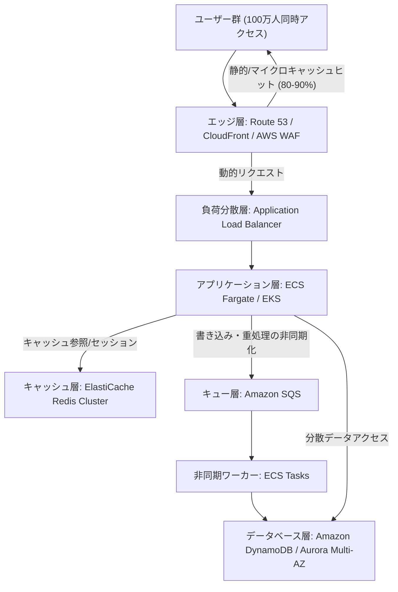

# ApexScale-AWS-Infra 🚀

> 100万人同時アクセス（CCU）の超高負荷スパイクに耐えうる、真の水平スケール＆高耐障害（Resilience）AWSインフラストラクチャ

---

## 🌟 プロジェクト概要

単にサーバースペックを引き上げる「垂直スケール」の限界を打破し、**「負荷を極限までエッジとキャッシュで遮断・分散し、ボトルネックを排除する」**思想に基づいた本格的な IaC (Infrastructure as Code) プロジェクトです。

秒間数十万 RPS に達する過激なスパイクを想定し、90%のリクエストをエッジ・CDN層で吸収しつつ、ステートレスなコンテナクラスタと非同期メッセージング、分散 NoSQL/Aurora Multi-AZ を組み合わせた鉄壁の構成を提供します。

### 💡 設計のハイライト
- **エッジ防御 (80-90%を最前線で吸収)**: CloudFront + AWS WAF + 仮想待合室連携によるオリジン保護
- **完全ステートレス・アプリケーション層**: ECS / EKS による数秒単位のオートスケーリング
- **多層インメモリキャッシュ**: ElastiCache (Redis Cluster) によるキャッシュスタンピード対策
- **非同期書き込みパイプライン**: SQS を活用した書き込みバッファリングと遅延永続化
- **耐障害マルチAZ設計**: 単一障害点を完全排除した自己治癒アーキテクチャ

---

## 🏗️ インフラ構成図



---

## 📁 ディレクトリ構造

```text
.
├── terraform/
│   ├── environments/
│   │   ├── dev/
│   │   │   ├── main.tf
│   │   │   ├── variables.tf
│   │   │   └── terraform.tfvars
│   │   └── prod/
│   │       ├── main.tf
│   │       ├── variables.tf
│   │       └── terraform.tfvars
│   └── modules/
│       ├── edge/       # CloudFront, Route53, WAF
│       ├── network/    # VPC, Subnets, NAT Gateway, Route Tables
│       ├── compute/    # ECS Cluster, Task Definitions, Auto-scaling
│       ├── cache/      # ElastiCache Redis Cluster
│       ├── queue/      # SQS (Dead Letter Queue含む)
│       └── database/   # DynamoDB, Aurora Cluster, RDS Proxy
└── README.md
```

---

## 🚀 展開手順 (Deployment)

### 前提条件
- Terraform >= 1.5.0
- AWS CLI v2 (認証設定済み)

### デプロイステップ

```bash
# 1. リポジトリのクローン
git clone https://github.com/code-refinery-works/ApexScale-AWS-Infra.git
cd ApexScale-AWS-Infra/terraform/environments/prod

# 2. 初期化
terraform init

# 3. 実行計画の確認
terraform plan

# 4. インフラのプロビジョニング
terraform apply
```

---

## 🎭 キャスト & エンドロール (Production Credits)

本プロジェクトは『AIアプリ工場劇場』の精鋭エージェントたちによって設計・実装・検証されました。

- agent🔵 : **要件定義・アーキテクチャコンセプト策定** (100万人耐性・疎結合設計モデル立案)
- agent🍇 : **インフラ詳細設計 & モジュール分割** (可用性・冗長性・コスト最適化設計)
- agent🍊 : **Terraform 実装** (爆速かつ堅牢なコードベースのプロビジョニング)
- agent🟢 : **コードレビュー & セキュリティ監査** (IaC静的解析・ベストプラクティス検証)
